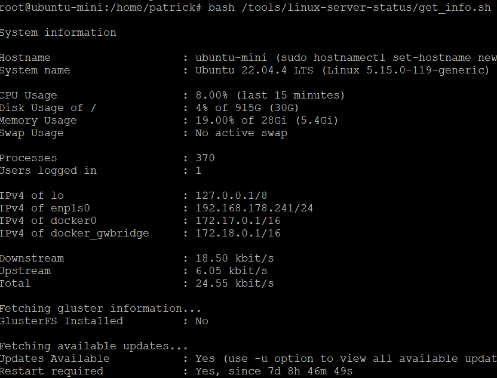

# linux-server-status
Quick output of server status. Similar to info upon login via ssh.

# Preview

## Basic usage
   

## Update procedure
 

# Prerequisities
Install Bash

```bash
sudo apt update
sudo apt install bash
```


# First Setup

### Quick Option 1 (few people are expected to log into server)
```bash
sudo mkdir -p /tools/linux-server-status
cd /tools/linux-server-status
sudo git clone https://github.com/Sokrates1989/linux-server-status.git .
```

### Quick Option 2 (default location for administrative installations)
```bash
sudo mkdir -p /usr/local/linux-server-status
cd /usr/local/linux-server-status
sudo git clone https://github.com/Sokrates1989/linux-server-status.git .
```

### Custom location
```bash
# Choose location on server (replace desired destintation with /desired/destination).
mkdir -p /desired/destination/linux-server-status
cd /desired/destination/linux-server-status
git clone https://github.com/Sokrates1989/linux-server-status.git .
```


# Usage

### Quick Option 1
```bash
bash /tools/linux-server-status/get_info.sh
```
### Quick Option 2
```bash
bash /usr/local/linux-server-status/get_info.sh
```
### Custom dir 
```bash
bash /desired/destination/linux-server-status/get_info.sh
```

# Output Files for messaging.
Also writes percentages of server usage into files so that they can be mapped into docker images. These files can be used to monitor the server state and send server state infos via Telegram, email or other messaging tools.

## Json

#### Default json output file
Writes output to path/to/server-states/system_info.json
```bash
bash /path/to/get_info.sh --json
```

#### Custom file
You can also provide a custom file where to write the json file to
```bash
# Ensure custom file exists.
mkdir -p /custom/path
touch /custom/path/file.json

# Command option short.
bash /path/to/get_info.sh --json -o /custom/path/file.json
# Command option long.
bash /path/to/get_info.sh --json --output-file /custom/path/file.json
```


### Cronjob
Setup cron to get periodic system info.

```bash
# Open crontab in edit mode.
crontab -e
```

```bash
# Execute command every hour at :59 min .
59 * * * * /bin/bash /path/to/get_info.sh --json --output-file /custom/path/file.json

# Second Example as used on prod servers.
59 * * * * /bin/bash /gluster_storage/linux-server-status/get_info.sh --json --output-file /serverInfo/system_info.json
```


